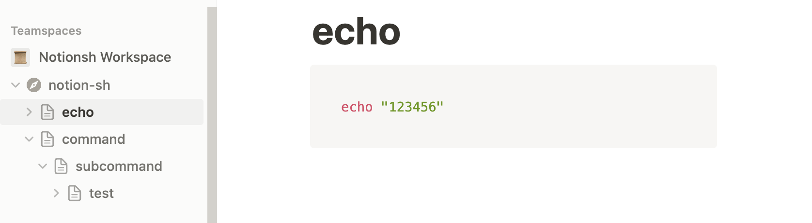

# Notion Sh

Organize your shell scripts in Notion and run your scripts from anywhere.

<!-- toc -->

# Table of Content

- [Getting Started](#getting-started)
- [Usage](#usage)
- [Commands](#commands)
<!-- tocstop -->

# Getting Started

1. Create a Notion Developer Integration [here](https://www.notion.so/my-integrations)
   - Save the token somewhere safe, will use it in step 5
2. Create a Notion page `notion-sh` (spelling must be same)
3. Create child pages inside `notion-sh`
   - the name of the child page will be the shell command name
   - include alphabetical characters only, like `echo`
4. Add code blocks for your shell scripts
5. `NOTION_TOKEN=... npx notionsh run`
6. 🎉

# Command Structure



Under the `notion-sh` page, all child pages are executable commands. Grouping commands into categories are also avaliable.

In the above example, `npx notionsh run` will list 4 commands:

```sh
$ npx notionsh run

✔ Loading scripts from your Notion pages...
? Execute -> echo
echo
command
command subcommand
command subcommand test
```

# Usage

<!-- usage -->

```sh
$ npx notionsh run
✔ Loading scripts from your Notion pages...

Select a script to execute:
- xxx
- xxx
...
```

<!-- usagestop -->

# Commands

<!-- commands -->

- [`notionsh run`](#notionsh-run)

## `notionsh run`

Fetch your script from Notion and execute it.

```
USAGE
  $ notionsh run

```
